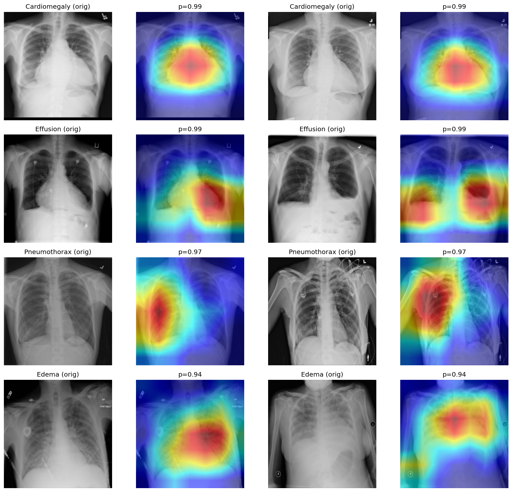

# Phase 6: Grad-CAM Interpretability and Shortcut Audit

Interpretability pass for the Phase 4/5 deployment model. This phase does not train a new model. It loads the weighted DenseNet-121 checkpoint, generates Grad-CAM overlays for confident true-positive test examples, and quantifies how much Grad-CAM activation falls near the outer image border as a simple shortcut-risk check.

---

## Table of Contents

- [Overview](#overview)
- [Phase Questions](#phase-questions)
- [Dataset Description](#dataset-description)
- [Model Architecture](#model-architecture)
- [Methodology](#methodology)
- [Key Findings](#key-findings)
- [Project Structure](#project-structure)
- [Requirements](#requirements)
- [How to Run](#how-to-run)
- [Results Summary](#results-summary)
- [Ideas for Extension](#ideas-for-extension)

---

## Overview

Phase 6 checks whether the weighted DenseNet-121 model is using plausible chest anatomy or leaning on image-border artifacts, text markers, devices, or other shortcut cues. The notebook uses the same Phase 1 patient-safe splits and the same Phase 4 weighted checkpoint:

```text
models/densenet_finetune_weighted.pt
```

The model is already evaluated in earlier phases at **0.7970 test macro-AUROC**, **0.3108 macro precision**, **0.3454 macro recall**, and **0.3061 macro F1** at threshold `0.5`. Phase 6 does not change those metrics. Instead, it explains high-confidence test predictions with Grad-CAM and writes two interpretability artifacts:

```text
results/gradcam_gallery.png
results/shortcut_border_fraction.csv
```

---

## Phase Questions

- Do high-confidence predictions activate medically plausible regions of the chest image?
- Which disease labels show the most activation near image borders?
- Does Cardiomegaly, a central anatomy task, focus on the cardiac silhouette?
- Do border-heavy findings such as Emphysema, Effusion, Pneumothorax, or Nodule need closer shortcut review?
- What interpretability artifacts should later deployment/model-card phases include?

---

## Dataset Description

Phase 6 reuses the same split CSV files from Phase 1.

| File | Rows | Role |
|---|---:|---|
| `train_data.csv` | 76,277 | Loaded for pipeline consistency |
| `val_data.csv` | 10,247 | Loaded for pipeline consistency |
| `test_data.csv` | 25,596 | Source of Grad-CAM examples and shortcut audit |

The notebook uses the same 14 disease labels:

```text
Atelectasis, Cardiomegaly, Consolidation, Edema, Effusion, Emphysema,
Fibrosis, Hernia, Infiltration, Mass, Nodule, Pleural_Thickening,
Pneumonia, Pneumothorax
```

Grad-CAM examples are selected from true-positive test cases, sorted by the model's predicted probability for the target disease.

---

## Model Architecture

The phase loads the weighted DenseNet-121 checkpoint from Phase 4:

```text
Input X-ray image                  [B, 3, 224, 224]
DenseNet-121 feature extractor     -> [B, 1024]
classifier = Linear(1024 -> 14)    -> [B, 14] logits
sigmoid(logits)                    -> [B, 14] probabilities
Grad-CAM target layer              model.features.norm5
```

`model.features.norm5` is the final convolution-stage normalization layer before global pooling. That layer still has spatial structure, so Grad-CAM can project class-specific activation back onto the resized `224 x 224` image.

---

## Methodology

### 1. Reuse the established data pipeline

The notebook reuses `ChestImageDataset`, ImageNet normalization, `224 x 224` resizing, and `DataLoader(batch_size=64, num_workers=4)` from the earlier modeling phases.

### 2. Load the weighted deployment checkpoint

DenseNet-121 is rebuilt with `weights=None`, its classifier head is replaced with a 14-output layer, and `densenet_finetune_weighted.pt` is loaded.

### 3. Score the held-out test split

The notebook runs the weighted model on the test loader and stores `y_true_test` and `y_score_test`. Test loader order is not shuffled, so selected indices match `test_dataset`.

### 4. Select confident true positives

For each disease, `top_examples()` filters to true-positive test images and sorts them by predicted probability. The gallery shows the top two true positives for:

```text
Cardiomegaly, Effusion, Pneumothorax, Edema
```

### 5. Generate Grad-CAM overlays

For a selected image and disease target, the notebook computes Grad-CAM for that disease logit, denormalizes the input image, overlays the heatmap, and saves the gallery.

### 6. Quantify border activation

The shortcut audit defines the outer 12% frame of the Grad-CAM map as the border ring. For each disease, the notebook averages the fraction of Grad-CAM mass in that ring across up to 10 confident true positives.

The exported value is:

```text
mean_border_frac = Grad-CAM mass in outer frame / total Grad-CAM mass
```

This is a shortcut-risk proxy, not proof of shortcut use. High values mark classes that deserve visual review.

---

## Key Findings

### 1. No border-shortcut detected — every class sits below the uniform baseline

The `mean_border_frac` values only mean something against a reference. The border ring (outer 12% on each side) covers **~42% of the image area**, so activation spread *uniformly* across the image would score **~0.42**. Every one of the 14 diseases falls **below** that line — the highest is Emphysema at **0.387**, and the mean across labels is **0.199**. In other words, no class concentrates its attention on the image frame, where burnt-in text and laterality markers live. There is **no evidence of a border/text shortcut** on this model.

### 2. The ordering tracks anatomy (the strongest evidence)

More telling than the average is *which* classes rank where — and it lines up with where each pathology actually appears:

| Disease | Mean border fraction | Anatomical expectation |
|---|---:|---|
| **Cardiomegaly** | **0.066** (lowest) | Enlarged heart — dead center, so attention should be maximally central ✓ |
| Hernia | 0.087 | Central / diaphragmatic ✓ |
| ... | ... | |
| Pneumothorax | 0.259 | Peripheral lung edge / apex ✓ |
| Effusion | 0.262 | Costophrenic-angle fluid, basal / lateral ✓ |
| **Emphysema** | **0.387** (highest) | Diffuse whole-lung hyperinflation — spreads toward the periphery ✓ |

The model attends **peripherally exactly when the disease is peripheral** and **centrally when the disease is central** — the opposite of a shortcut. This per-disease anatomical consistency is the most convincing evidence in the phase that the model learned real chest anatomy, not framing artifacts.

### 3. The gallery corroborates the numbers

The displayed true positives are high-confidence (Cardiomegaly ~0.99, Effusion ~0.99, Pneumothorax ~0.97, Edema ~0.94), and the overlays sit over plausible regions — the Cardiomegaly maps center on the cardiac silhouette, while Effusion / Pneumothorax / Edema maps reach toward the lateral and basal zones, matching both the anatomy and the quantitative audit.



### 4. What the metric can and cannot show

`mean_border_frac` is a **shortcut-risk proxy, not proof**. It flags where attention *falls*, not whether the model is clinically correct, and Grad-CAM is coarse for multi-label targets. Two honest caveats: (a) a below-uniform score rules out a *gross* border shortcut but not subtler artifact reliance (e.g. support devices inside the lung fields); (b) the elevated peripheral classes still merit a visual spot-check, even though their elevation is anatomically expected. This audit should be read alongside the per-class AUROC/F1 tables from Phases 4 and 5, not in place of them.

---

## Project Structure

```text
Chest-XRay-Project/
|
|-- models/
|   |-- densenet_finetune_weighted.pt       # Weighted DenseNet checkpoint used here
|
|-- phase-1/
|-- phase-2/
|-- phase-3/
|-- phase-4/
|-- phase-5/
|
|-- phase-6/
|   |-- chest-xray-detection-phase6.ipynb   # Grad-CAM and shortcut audit notebook
|   |-- phase-6-README.md                   # This file
|
|-- results/
|   |-- train_data.csv
|   |-- val_data.csv
|   |-- test_data.csv
|   |-- per_class_test_densenet_weighted.csv
|   |-- gradcam_gallery.png                 # Saved Grad-CAM examples
|   |-- shortcut_border_fraction.csv        # Border-activation audit
```

---

## Requirements

```text
Python 3.8+
pandas
numpy
torch
torchvision
Pillow
kagglehub
matplotlib
grad-cam
jupyter
```

Install dependencies:

```bash
pip install pandas numpy torch torchvision pillow kagglehub matplotlib grad-cam jupyter
```

A GPU is recommended because Grad-CAM requires gradient passes through DenseNet-121. The notebook was run on `cuda`.

---

## How to Run

1. Attach the NIH Chest X-ray image dataset, the Phase 1 split CSV files, and the weighted DenseNet checkpoint.
2. Open `phase-6/chest-xray-detection-phase6.ipynb`.
3. Run the setup, dataset, transform, and loader cells.
4. Load `densenet_finetune_weighted.pt`.
5. Run the test-set scoring cell to create `y_true_test` and `y_score_test`.
6. Generate the Grad-CAM gallery for the selected diseases.
7. Run the border-fraction audit and export `shortcut_border_fraction.csv`.

Expected exported files:

```text
gradcam_gallery.png
shortcut_border_fraction.csv
```

---

## Results Summary

### Border activation audit

| Rank | Disease | Mean border fraction |
|---:|---|---:|
| 1 | Emphysema | 0.387 |
| 2 | Effusion | 0.262 |
| 3 | Pneumothorax | 0.259 |
| 4 | Nodule | 0.243 |
| 5 | Pleural_Thickening | 0.203 |
| 6 | Edema | 0.201 |
| 7 | Mass | 0.192 |
| 8 | Consolidation | 0.191 |
| 9 | Atelectasis | 0.187 |
| 10 | Infiltration | 0.183 |
| 11 | Fibrosis | 0.174 |
| 12 | Pneumonia | 0.150 |
| 13 | Hernia | 0.087 |
| 14 | Cardiomegaly | 0.066 |

### Interpretation

- Cardiomegaly is the strongest interpretability sanity check: centered heatmaps and the lowest border fraction.
- Emphysema, Effusion, Pneumothorax, and Nodule are the priority labels for shortcut review.
- Edema is near the overall average but the gallery still shows some edge spill, so qualitative review remains useful.
- The audit should be repeated on external data before claiming that shortcut behavior is controlled.

---

## Ideas for Extension

### 1. Add lesion-aware localization checks

Compare Grad-CAM maps against bounding boxes or radiologist-provided regions where available.

### 2. Audit non-disease shortcuts directly

Segment or mask text markers, borders, and medical devices, then measure prediction changes under controlled occlusion.

### 3. Generate per-class Grad-CAM contact sheets

Save galleries for all 14 diseases, not only the four displayed examples.

### 4. Compare weighted and threshold-tuned checkpoints

Run the same Grad-CAM audit on the unweighted fine-tuned model with tuned thresholds to see whether the operating-point fix changes attention patterns.

### 5. Add model-card evidence

Use the gallery, border-fraction table, and known limitations as the interpretability section of the deployment model card.

---

*Phase 6 turns the project from "the model scores well" toward "the model is at least partly inspectable." The weighted DenseNet's Cardiomegaly behavior looks centered and plausible, while high border-fraction classes such as Emphysema, Effusion, Pneumothorax, and Nodule should be treated as shortcut-review priorities before deployment.*
